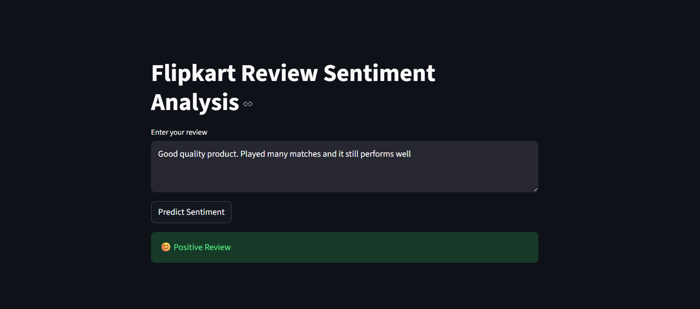

# Flipkart Review Sentiment Analysis

This project focuses on analyzing customer sentiment from Flipkart product reviews using **Natural Language Processing (NLP)** and **Machine Learning**.  
The application classifies reviews as **Positive** or **Negative** and provides real-time predictions using a **Streamlit web application**.

---

## 📌 Business Objective

- Automatically classify Flipkart reviews as Positive or Negative  
- Understand customer feedback and dissatisfaction points  
- Reduce manual effort in analyzing large volumes of reviews  
- Provide a simple web interface for real-time sentiment prediction  

---

## 📊 Dataset

- **Source:** Flipkart product reviews dataset (provided for internship project)  
- **Records:** ~20,000 reviews  
- **Key Columns Used:**  
  - Review Text  
  - Rating (used to derive sentiment label)  

**Sentiment Labeling Logic:**
- Rating ≥ 4 → Positive  
- Rating ≤ 2 → Negative  
- Rating = 3 → Removed (neutral)

---

## 🧹 Data Preprocessing

The following preprocessing steps were applied:

- Conversion to lowercase  
- Removal of special characters and punctuation  
- Stopword removal  
- Lemmatization using NLTK  
- Removal of missing and neutral reviews  

---

## 🧠 Model & Approach

- **Feature Extraction:** TF-IDF Vectorization (unigrams + bigrams)  
- **Model Used:** Logistic Regression  
- **Evaluation Metric:** F1-Score  
- **Final Performance:**  
  - F1-Score ≈ **0.98**

Logistic Regression was selected due to its strong performance, simplicity, and interpretability.

---

## 🌐 Streamlit Web Application

The Streamlit app allows users to:
- Enter a product review  
- Get instant sentiment prediction  
- View results in a clean and user-friendly interface  

📸 **Application Preview:**  


---

## 📁 Project Structure

## 📁 Project Structure

```text
flipkart-review-sentiment-analysis/
│
├── app.py                     # Streamlit web application
├── requirements.txt           # Python dependencies
│
├── data/                      # Dataset files
│   └── Flipkart_Review.csv
│
├── model/                     # Trained models and vectorizers
│   ├── sentiment_model.pkl
│   └── tfidf_vectorizer.pkl
│
├── notebooks/                 # Jupyter notebooks (EDA & training)
│   └── sentiment_analysis.ipynb
│
├── images/                    # Application screenshots
│   └── streamlit_ui.png
│
└── README.md                  # Project documentation
```


---

## ▶️ How to Run the Project Locally

1. Clone the repository:
```bash                                                                                                                                                                                            `                                                     
git clone https://github.com/sankya-jadhav/flipkart-review-sentiment-analysis.git

pip install -r requirements.txt

streamlit run app.py

---

☁️ Deployment

The application is deployed using Streamlit on AWS EC2

EC2 instance is configured with required security rules

App is accessible via public IP and port 8501

---

📌 Key Learnings

Built an end-to-end NLP pipeline

Learned practical text preprocessing techniques

Understood model evaluation using F1-score

Gained hands-on experience with Streamlit and AWS EC2 deployment

---

🙏 Acknowledgment

Thanks to Innomatics Research Labs for providing the dataset and guidance throughout this internship project.

